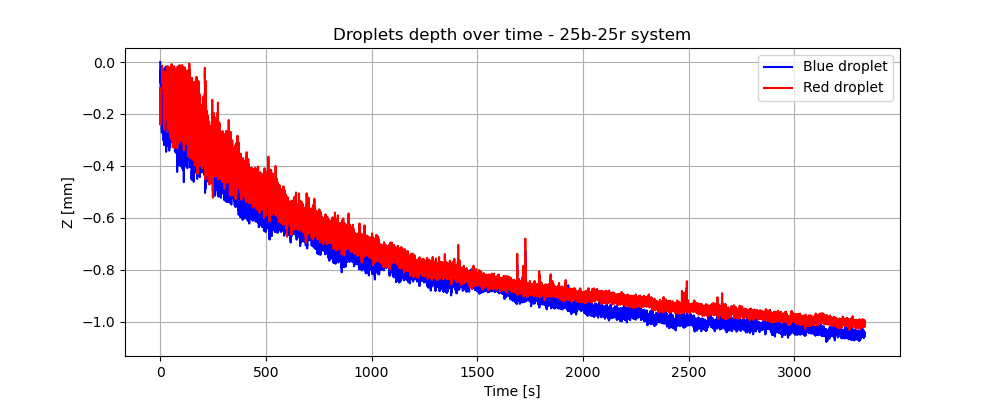

# Tracking and Analysis of self-propelled droplets
In this project, a synthetic realization of an active matter system consisting of 50 self-propelled droplets is analyzed through the means of non-equilibrium statistical mechanics.
Droplet trajectories are extracted from video recordings with a tracking pipeline that is developed using computer vision algorithms, allowing us to characterize the dynamical collective behaviour of the system.

## Tracking :shipit:
Starting from the video recordings of droplets moving in the solution we want to obtain the droplets' positions and radii maintaining their identity over time. This procedure consists in four steps:
* **Pre-processing**: prepares the frame images for the detection algorithm
* **Detection**: individuates droplet's positions and radii at each frame of the video recording.
* **Linking**: connects droplets' features over consecutive frames, preserving droplets identity.
* **Post-processing**: cleans the resulting trajectoris from spurious features detected.

The result of this procedure is shown in the following video: \

## Analysis
To analyze the trajectories obtained from the tracking procedure and characterize the emergent behaviour of droplets we analyze the following metrics:
* **Droplet Depth Evolution**: We investigate how the depth of droplets within the solution changes over time. Understanding the temporal variations in droplet depth is essential for predicting their activity and stability.\
  
* **Mean Squared Displacement**: In order to assess the diffusive behaviour of droplets the Mean Squared Displacement (MSD) is a fundamental metric. We analyze the MSD of droplets to quantify their mobility and diffusion patterns.\
   
* **Speed distribution**: The distribution of droplets' speed provides insights into their overall flow and motion of them within the solution.\
   
* **Turning Angles Distribution**: The analysis of turning angles can reveal information about the droplets' rotational diffusion and to discern any preferred orientations or angular patterns.\
   
* **Velocity Autocovariance**: Velocity autocovariance functions are employed to study the temporal correlations in droplet velocities and to discern any persisting motion pattern.\
   
* **Radial Distribution Function**: The radial distribution function is a key tool for understanding the spatial arrangement and ordering of droplets within the solution. We explore how droplet structures affect this function, providing insights into the local ordering among droplets.\
    
* **Graph-based analysis**: Studying the graph properties of droplets' spatial arrangements is a powerful tool to understand spatio-temporal patterns in the evolution of the system under study.\
  
